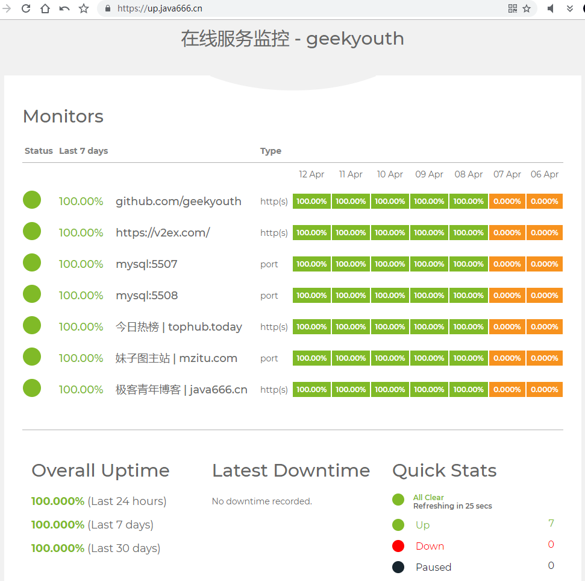
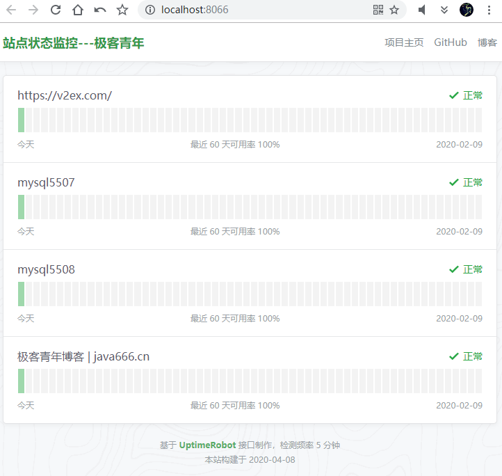
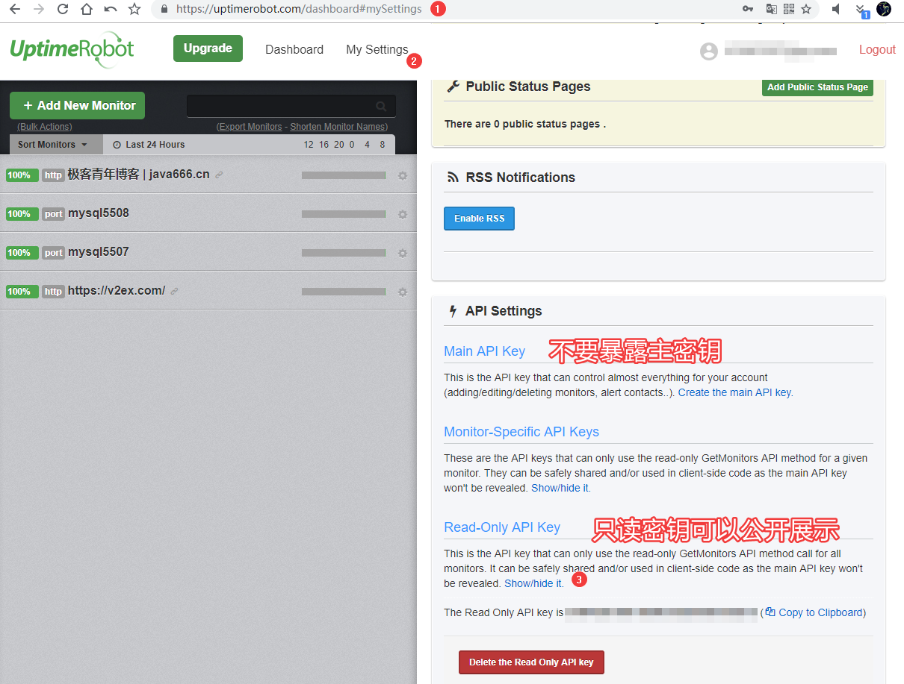
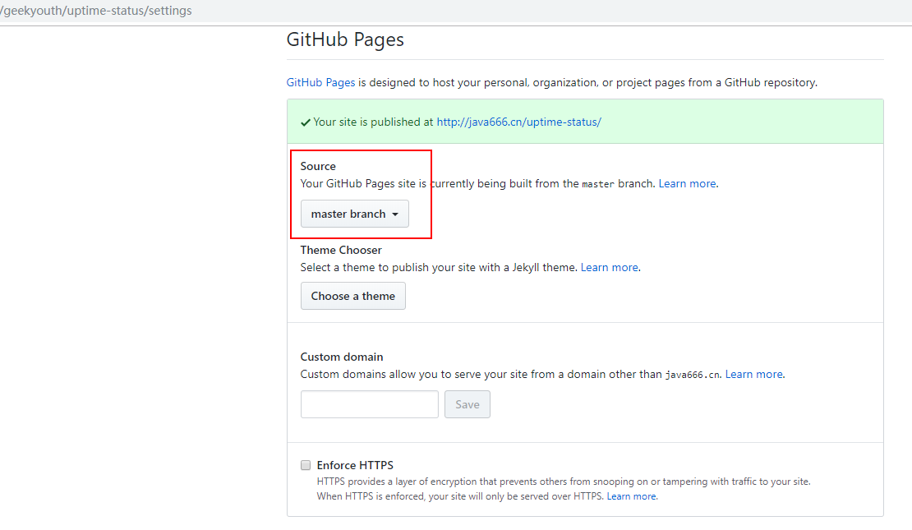
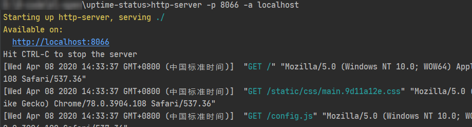

# 站点状态监控
- 本项目可以直接部署，快速上线，纯静态无需服务器。基于 UptimeRobot api 时时监控主机、网站、端口等在线状态；  
- 依赖 github 静态页面，天然支持穿透天朝防火墙，理论上任何暴露于公网的墙外网站和端口服务都可以监控。  


## 在线体验：  
> 之前的短域名 `https://up.java666.cn/` 被回收了，因为 uptimerobot 要对此功能收费。
完整版：<https://stats.uptimerobot.com/OJRWxTANwN>  
  

简化版：<https://java666.cn/uptime-status/>  
  


## 如何复用这个项目？  
1- fork 一份到你的 github 账号下；  
2- 修改配置文件：config.js，主要是修改 apikey 内容，强烈建议使用 Read-Only key,<https://uptimerobot.com/dashboard#mySettings> 如下图；  
  
3- 打开github-pages，你就可以愉快的体验了。  
   

## 本地调试：
需要使用 node.js 安装 http-server 模块，然后开启 http 服务预览：  
win 命令 （如果控制台报错 `TypeError: Readable.from is not a function` 则需要升级 node 版本号）:
```bat
npm install http-server -g
http-server -p 8066 -a localhost
```



## 说明：

本项目是来自原作的简化版：<https://github.com/yb/uptime-status>

## 更新：

### 2021-01-06:
- 更新超链接和命令，`https://up.java666.cn` 替换为 https://stats.uptimerobot.com/OJRWxTANwN

V1.2:
- 加入 https://up.java666.cn

V1.1：  
- 加入自定义页脚；    
- 补充调试文档；  
- 加入页脚；  

V1：  
- 上线
